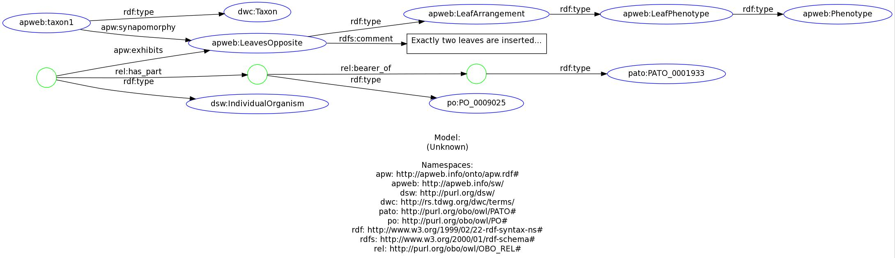

Data modeling for APweb
=======================

The primary goal of APweb is to present information, gleaned from the
literature, about plant taxa.  The information currently are in the
form of both free text descriptions and atomic statements about
synapomorphies.  In this APweb2 project, these data are being prepared
primarily for the semantic web, meaning a fair degree of consideration was
needed to chose the best modeling schema.  The criteria for ‘best,’
include simplicity, minimizing the need for blank nodes (or
book-keeping URIs), interoperability (with other semantic biodiversity
modeling projects), re-use of terms where possible, consistency with
contemporary philosophical understanding of taxa and phenotypes.

The core elements of the APweb model are:

 * **Taxa are instances (or individuals)** of a taxon class
   (`dwc:Taxon`) with a `part_of` relationship among them.  This
   differs from, e.g., the [Uniprot taxonomy][] (based on the
   [NCBI taxonomy][]) where taxa are modeled as a class hierarchy, but
   is consistent with a view that taxa are _unique_ lineages (of
   genes), with subtaxa ‘being parts’ thereof, or even ‘containing
   parts’ (in the case of reticulate evolution).  See discussions by
   Ereshefsky, Ghiselin, Hull and others, and
   [this page](hp://phenoscape.org/wiki/Taxonomy_ontology) from the
   Phenoscape project.
 * Phenotypes can be properties of **either taxa and individual
   plants**. While the data in APweb refer to taxa (generally higher
   taxa than species), the phenotype definitions and their RDF
   representations should have the potential for wide use, including
   modeling observations of individual organisms. 
 * As modeled here, a phenotype is the **abstract notion** of a taxon or
   an individual plant having, _at some time_, _in some places_, and
   _in some organs_, and, for a taxon, _in some individual_, a
   particular morphological, anatomical or genetic characteristic.
 * The general, abstract **phenotypes** we define **are individuals**
   (of type `apw:Phenotype`). Assuming we are all thinking of the same
   thing, there is a single abstract concept ‘opposite leaf
   phenotype,’ even though there as many applications of the concept
   as there are taxa and individuals.
 * Taxa or individuals can `apw:exhibit` a particular
   phenotype. Note that the `rdfs:domain` of `apw:exhibit` is not specified.
 * A taxon can have the property of a `apw:synapomorphy` of a
   particular phenotype. Note that the `rdfs:domain` of
   `apw:synapomorphy` _is_ specified, as `dwc:Taxon`.
 * We define the phenotype _in words_ as the atomic combination of
   traits that is more traditionally represented as a **character
   state**.  There are various modeling schemes for encoding the
   phenotypes of an individual taxon:<ul>
 *   The character state of a character (`LeafArrangement :
     Opposite`). This is perhaps most common, e.g., in
     [DELTA](http://delta-intkey.com/) descriptions, and NEXUS
     character matrices ([Maddison et al. 1997](#nex)),
 *   The state of a character of an entity (`Leaf : Arrangement :
     Opposite`; [Pullan et al. 2005](#pul)),
 * The quality of an entity (‘EQ’; see [Mabee et al. 2007](#mab))
     (`Leaf : ArrangementOpposite`),</ul> 
   The latter is most compatible with current resources in the
   semantic web, with the existence of the
   [Plant Ontology](http://www.plantontology.org/) for anatomy, and
   the [PATO](http://obofoundry.org/wiki/index.php/PATO:Main_Page)
   ontology for phenotypic qualities, and we will try to map our
   phenotypes to these other modeling systems, to provide added rigor
   to definitions. However, our experience indicates that many common
   plant phenotypes cannot be easily and unambiguously mapped to
   existing PO and PATO terms, and so the EQ mappings be provide are
   _not normative_, while the text descriptions of the phenotype
   are. The expositions of APweb phenotypes will be modeled using an
   individual organism that has an entity organ which has an instance
   of the quality (Fig. 1).
   

An example of the encoding of an observation using this schema is (in
the turtle serialization of RDF data; see Fig. 1 for a visual representation):

      @prefix rdfs: <http://www.w3.org/2000/01/rdf-schema#> .
      @prefix dwc: <http://rs.tdwg.org/dwc/terms/> .
      @prefix apw: <http://apweb.info/onto/apw.rdf#> .
      @prefix apweb: <http://apweb.info/sw/> .
      @prefix pato: <http://purl.org/obo/owl/PATO#> .
      @prefix po: <http://purl.org/obo/owl/PO#> .
      @prefix rel: <http://purl.org/obo/owl/OBO_REL#> .
      @prefix dsw: <http://purl.org/dsw/> .

      # This is the taxon information:
      apweb:taxon1 a dwc:Taxon ;
          apw:synapomorphy apweb:LeavesOpposite ;

      # The following is the phenotype description:
      apweb:LeavesOpposite a apweb:LeafArrangement ;
          rdfs:comment "Exactly two leaves are inserted..." .
	  
	  apweb:LeafArrangement a apweb:LeafPhenotype .
      apweb:LeafPhenotype a apweb:Phenotype .
	  
	  [] apw:exhibits apweb:LeavesOpposite;
          a dsw:IndividualOrganism ;
          rel:has_part [
		      a po:PO_0009025 ;
              rel:bearer_of  [
                  a pato:PATO_0001933 ;
              ] ;
          ] .

The APweb ontology
------------------

Not finding them elsewhere, a few terms and concepts required new
definitions. A small APweb ontology exists at
<http://apweb.info/onto/apw.rdf>. We used Protege for modeling in OWL,
although RDFS is sufficient.

      @prefix rdf: <http://www.w3.org/1999/02/22-rdf-syntax-ns#> .
      @prefix rdfs: <http://www.w3.org/2000/01/rdf-schema#> .
      @prefix apw: <http://apweb.info/onto/apw.rdf#> .
      @prefix owl: <http://www.w3.org/2002/07/owl#> .
	  @prefix dwc: <http://rs.tdwg.org/dwc/terms/> .

      apw:Phenotype
          a owl:Class ;
          rdfs:comment """An abstract phenotype of a taxon or 
		                  an individual organism."""@en .

      apw:exhibits
          a owl:ObjectProperty ;
          rdfs:comment """The taxon or individual organism has been 
		      found in some places or times to exhibit this
              phenotype. Domain: taxon or individual."""@en ;
          rdfs:range apw:Phenotype ;

      apw:synapomorphy
          a owl:ObjectProperty ;
          rdfs:domain dwc:Taxon ;
          rdfs:range apw:Phenotype ;
          rdfs:comment """A trait that is shared by ancestry among
              this taxon and (some of) its descendent taxa that is not 
			  shared by its ancestor."""@en .

Both taxa, as defined by APweb, and phenotypes (and their
definitions; see example above), exist as URIs at
http://apweb.info/sw/ for which we use the namespace `apweb`.

References
----------

 * Mabee MP, Ashburner M, Cronk Q, Gkoutos GV,
   Haendel M, Segerdell E, Mungall C, Westerfield M. Phenotype
   ontologies: the bridge between genomics and evolution. Trends in
   Ecology & Evolution 22: 345–350. [DOI](http://dx.doi.org/j.tree.2007.03.013)
 * Maddison DR, Swofford DL, Maddison WP. 1997,
   NEXUS: An extensible file format for systematic
   information. Systematic Biology, 46:
   590-621. [DOI](http://dx.doi.org/10.2307/2413497)
 * Pullan MR, Armstrong KE, Paterson T, Cannon A,
   Kennedy JB, Watson MF, McDonald S, Raguenaud C. 2005. The
   Prometheus Description Model: an examination of the taxonomic
   description-building process and its representation. Taxon, 54:
   751–765.
    

  [NCBI taxonomy]: http://www.ncbi.nlm.nih.gov/Taxonomy/
  [Uniprot taxonomy]: http://www.uniprot.org/taxonomy/

